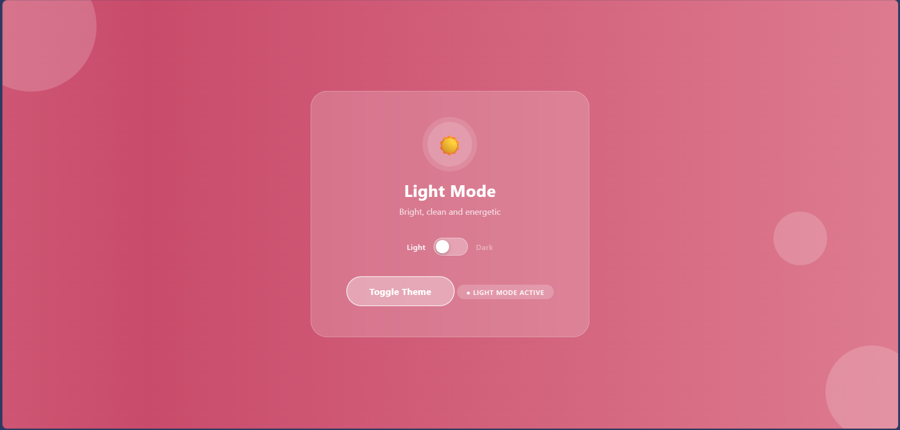
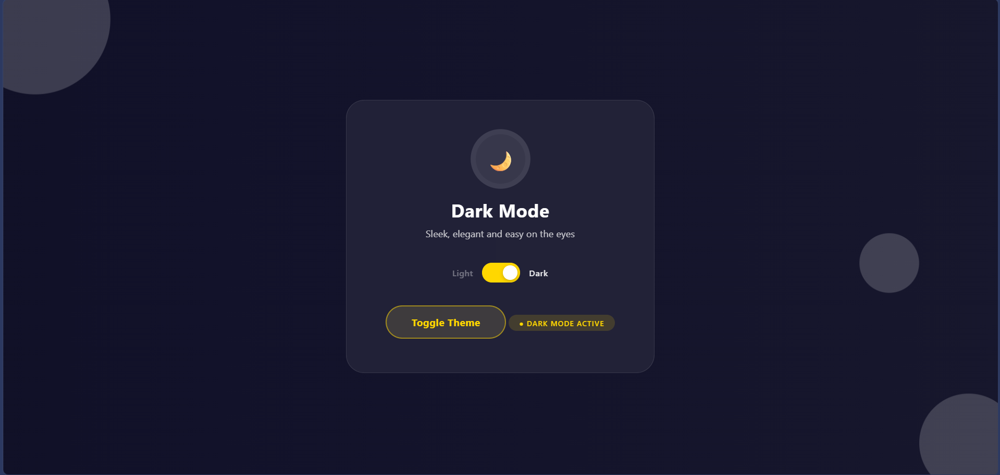

# 🌗 Theme Toggle

A sleek, animated light/dark mode toggle built with pure **HTML**, **CSS**, and **JavaScript**, no frameworks, no libraries.

---

## 🖼️ Preview




---

## ✨ Features

- 🎨 Animated gradient background that shifts colors continuously
- 🌊 Floating background orbs for depth and atmosphere
- 🔘 Smooth spring-animated toggle switch
- ☀️ / 🌙 Icon spins on every theme change
- 💛 Gold accent colors in dark mode
- 🏷️ Live mode badge that updates instantly
- 📱 Fully responsive layout

---

## 📁 Project Structure

```
ThemeToggle/
├── index.html    # Markup & structure
├── style.css     # All animations & theme styles
├── script.js     # Toggle logic
└── preview.png   # Screenshot for README
```

---

## 🚀 Getting Started

1. **Clone the repo**
   ```bash
   git clone https://github.com/your-username/theme-toggle.git
   cd theme-toggle
   ```

2. **Open in browser**
   ```bash
   # No build step needed — just open directly
   open index.html
   ```

---

## 🛠️ How It Works

The toggle is powered by a simple `dark` boolean in `script.js`. Clicking the button or switch calls `toggle()`, which flips the boolean and applies the `.dark` class to the `.page` element. CSS handles the rest through class-based styling.

```js
let dark = false;

function toggle() {
  dark = !dark;
  document.getElementById("page").classList.toggle("dark", dark);
}
```

---

## 🎬 Animations Used

| Animation | Effect |
|-----------|--------|
| `bgShift` | Gradient background slowly shifts left to right |
| `floatOrb` | Background orbs gently float up and down |
| `fadeIn` | Card slides up and fades in on load |
| `spinIcon` | Sun/moon icon spins on toggle |
| `pulse` | Icon ring pulses with a soft glow |

---

## 🎨 Theme Colors

| Mode | Background | Accent |
|------|------------|--------|
| Light | `#d75d71` → `#f0a0b0` (pink gradient) | White |
| Dark | `#0d0d1a` → `#1a1a2e` (navy gradient) | `#ffd700` Gold |

---

## 🛠️ Customization

### Change light mode colors
In `style.css`, update the `.page` background:
```css
.page {
  background: linear-gradient(270deg, #d75d71, #e997a5, #c94b6b, #f0a0b0);
}
```

### Change dark mode colors
```css
.page.dark {
  background: linear-gradient(270deg, #0d0d1a, #1a1a2e, #12122a, #0a0a1a);
}
```

### Change the subtitle text
In `script.js`, update the text inside the `toggle()` function:
```js
sub.textContent = "Your custom subtitle here";
```

---

## 🙋‍♀️ Author

**Kaneeza Batool**  
CS Undergraduate · Sukkur, Pakistan  
Built with 💜 using HTML, CSS & JS
